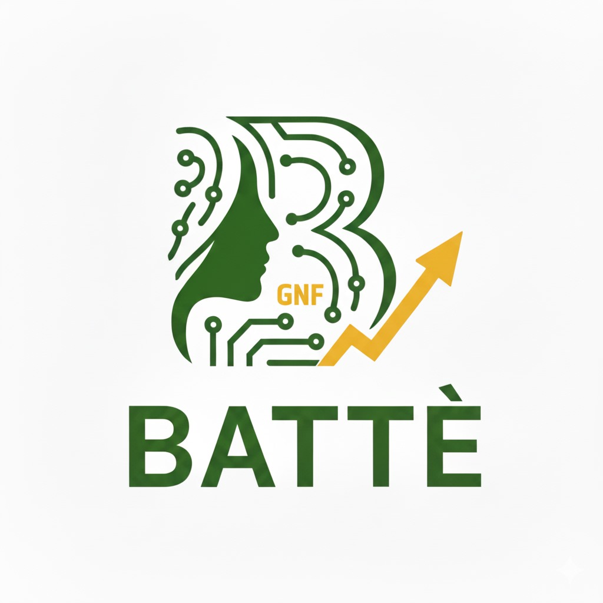

# 🚀 Battè - Application Mobile de Recyclage Intelligent

<div align="center">
  
  
  **Transformez vos déchets en argent avec une poubelle intelligente connectée !**
  
  [](https://github.com/ramatoulaye-sy/Batte/releases)
  [](https://flutter.dev)
  [](LICENSE)
  [](https://developer.android.com)
</div>

---

## 📱 **À PROPOS DE BATTÈ**

Battè est une application mobile révolutionnaire qui transforme le recyclage en une expérience gamifiée et rémunératrice. Grâce à des poubelles intelligentes connectées via Bluetooth, les utilisateurs peuvent recycler leurs déchets et gagner de l'argent en temps réel.

### **🎯 Mission**
- **Écologique** : Encourager le recyclage responsable
- **Économique** : Rémunérer les utilisateurs pour leurs efforts
- **Sociale** : Créer une communauté engagée pour l'environnement
- **Technologique** : Utiliser l'IoT pour moderniser la gestion des déchets

---

## ✨ **FONCTIONNALITÉS PRINCIPALES**

### **👤 Pour les Utilisateurs**
- 🔄 **Recyclage Intelligent** : Connexion Bluetooth aux poubelles intelligentes
- 💰 **Gains Automatiques** : Calcul instantané des récompenses
- 📊 **Suivi des Performances** : Statistiques détaillées et graphiques
- 🎓 **Éducation Environnementale** : Contenu éducatif et quiz
- 🛠️ **Services Communautaires** : Offrir et demander des services
- 📱 **Interface Moderne** : Design gamifié et intuitif

### **🚛 Pour les Collecteurs**
- 📍 **Géolocalisation** : Trouver les clients proches
- 📋 **Gestion des Collectes** : Suivi des demandes et historique
- 💼 **Profil Professionnel** : Gestion des informations et documents
- ⚙️ **Paramètres Avancés** : Configuration de disponibilité et préférences
- 📈 **Analytics** : Statistiques de performance et revenus

---

## 🏗️ **ARCHITECTURE TECHNIQUE**

### **Frontend**
- **Flutter 3.0+** : Framework de développement multiplateforme
- **Provider** : Gestion d'état réactive
- **Material Design 3** : Interface utilisateur moderne

### **Backend**
- **Supabase** : Base de données et authentification
- **Firebase** : Notifications push et analytics
- **PostgreSQL** : Base de données relationnelle

### **Connectivité**
- **Bluetooth** : Communication avec les poubelles intelligentes
- **Géolocalisation** : Services de localisation
- **Offline-First** : Fonctionnement sans connexion internet

### **Stockage**
- **Hive** : Base de données locale
- **SharedPreferences** : Préférences utilisateur
- **Synchronisation** : Sync automatique en ligne

---

## 📦 **INSTALLATION**

### **Prérequis**
- Android 5.0+ (API 21+)
- Flutter SDK 3.0+
- Dart SDK 3.0+

### **Installation de l'APK**
1. Téléchargez l'APK depuis [Releases](https://github.com/ramatoulaye-sy/Batte/releases)
2. Activez "Sources inconnues" dans les paramètres Android
3. Installez l'APK en le tapant

### **Installation depuis le code source**
```bash
# Cloner le dépôt
git clone https://github.com/ramatoulaye-sy/Batte.git
cd Batte

# Installer les dépendances
flutter pub get

# Générer les fichiers de code
flutter packages pub run build_runner build

# Lancer l'application
flutter run
```

---

## 🧪 **TESTS**

### **Guide de Test Complet**
Consultez le [Guide de Test Complet](GUIDE_TEST_COMPLET.md) pour tester toutes les fonctionnalités de l'application.

### **Tests Automatisés**
```bash
# Tests unitaires
flutter test

# Tests d'intégration
flutter test integration_test/
```

---

## 📱 **ÉCRANS DE L'APPLICATION**

### **Authentification**
- Splash Screen avec animation
- Onboarding interactif
- Connexion/Inscription
- Choix de profil (Utilisateur/Collecteur)

### **Dashboard Utilisateur**
- Vue d'ensemble des gains
- Statistiques de recyclage
- Graphiques des revenus
- Navigation rapide

### **Module de Recyclage**
- Connexion Bluetooth aux poubelles
- Ajout manuel de déchets
- Historique des recyclages
- Calcul automatique des prix

### **Module de Budget**
- Suivi des transactions
- Demandes de retrait
- Graphiques des revenus
- Export des données

### **Module d'Éducation**
- Articles éducatifs
- Quiz environnementaux
- Système de points
- Progression de lecture

### **Module de Services**
- Offres de services
- Demandes de services
- Messagerie intégrée
- Système de notation

### **Dashboard Collecteur**
- Gestion des collectes
- Suivi des performances
- Paramètres de disponibilité
- Analytics détaillées

---

## 🔧 **CONFIGURATION**

### **Variables d'Environnement**
Créez un fichier `.env` à la racine du projet :
```env
SUPABASE_URL=your_supabase_url
SUPABASE_ANON_KEY=your_supabase_anon_key
FIREBASE_PROJECT_ID=your_firebase_project_id
```

### **Configuration Supabase**
1. Créez un projet Supabase
2. Exécutez les scripts SQL dans le dossier `database/`
3. Configurez les politiques RLS
4. Activez l'authentification

### **Configuration Firebase**
1. Créez un projet Firebase
2. Ajoutez l'application Android
3. Téléchargez `google-services.json`
4. Configurez les notifications push

---

## 📊 **MÉTRIQUES DE PERFORMANCE**

- **Taille APK** : 56.9 MB
- **Taille App Bundle** : 45.6 MB
- **Temps de lancement** : < 5 secondes
- **Consommation mémoire** : Optimisée
- **Battery usage** : Faible impact

---

## 🤝 **CONTRIBUTION**

Les contributions sont les bienvenues ! Pour contribuer :

1. Fork le projet
2. Créez une branche pour votre fonctionnalité (`git checkout -b feature/AmazingFeature`)
3. Committez vos changements (`git commit -m 'Add some AmazingFeature'`)
4. Push vers la branche (`git push origin feature/AmazingFeature`)
5. Ouvrez une Pull Request

---

## 📄 **LICENCE**

Ce projet est sous licence MIT. Voir le fichier [LICENSE](LICENSE) pour plus de détails.

---

## 👥 **ÉQUIPE**

- **Développement** : Équipe Battè
- **Design** : Équipe UX/UI Battè
- **Backend** : Équipe Supabase/Firebase

---

## 📞 **SUPPORT**

- **Email** : batte@example.com
- **GitHub Issues** : [Signaler un bug](https://github.com/ramatoulaye-sy/Batte/issues)
- **Documentation** : [Wiki du projet](https://github.com/ramatoulaye-sy/Batte/wiki)

---

## 🎉 **REMERCIEMENTS**

Merci à tous les contributeurs et testeurs qui ont participé au développement de Battè !

---

<div align="center">
  <p>Fait avec ❤️ par l'équipe Battè</p>
  <p>🇬🇳 Made in Guinea</p>
</div>